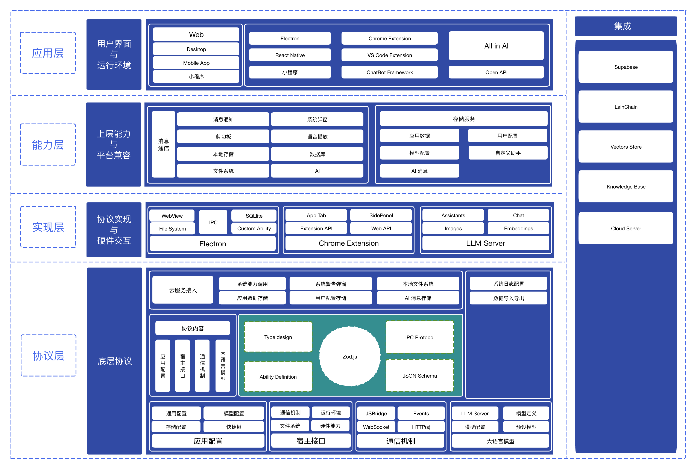

# SYan

TODO

## 目录结构

```
Project Files/
├── apps/
│   ├── landing-page/                # Web App
│   ├── syan-desktop/                # Electron App
│   ├── syan-mobile/                 # React Native App
│   ├── llm-server/                  # Standalone LLM Server，support nodejs/deno/serverless...
│   └── syan-extension/              # Chrome Extension
├── common/
│   └── profiles/
│       ├── tsconfig.*.json
│       └── typedoc.json
├── packages/                      # Common packages
│   ├── core-protocol/
│   ├── electron-main/
│   ├── electron-preload/
│   └── electron-protocol/
├── sdk/                       # NPM packages
│   └── client-js/
├── package.json
└── README.md
```

## 软件架构



## 本地开发

```bash
# 安装依赖
$ pnpm install

# 监听并构建依赖包
$ pnpm watch

# 启动 electron app
$ pnpm dev:desktop
```

## License

MIT
